# Understanding Home Thermostat Operation
**_Disclaimer: This writeup is not an "end-all, be-all" guide. It's over simplified and only meant to teach the basic concepts of how a thermostat operates. Wire colors, letter designations, HVAC components, etc...  are not standard everywhere. Unless you know what you're doing, consulting a certified HVAC Repair Technician is always the better option when it comes to servicing your home's HVAC system._**

That said, it never hurts to have a better understanding about how something works. Along with general knowledge of thermostat operation, this should also answer the following questions:
- Why does my thermostat need a `C` wire?
- Why does my thermostat say "no power" and/or isn't charging its battery?
- Why do I have multiple `R` wires (`R`, `Rh`, `Rc`)?
- Why doesn't each device have two wires at the thermostat? or Why are there so few wires at my thermostat?
### Preface
HVAC systems are made up of multiple electrical devices (fans/blowers, different heat sources, multiple A/C components, etc...) and these devices need power to operate. Some devices need to operate at the same time, while others can be operated independently. Some only need to run under certain conditions while others can be run on a schedule. Trust me, nobody wants to be the "brains" behind all of that and control it with a bunch of physical switches. 

Allow me to introduce you to...
### The Thermostat
The thermostat's job is to take care of all that "brain" stuff for us. It's meant to control all of those HVAC devices with as little human input as possible... a "set it and forget it" type of device. 

At their root, a thermostat is just an automatic switching device. They complete (close/turn on) or break (open/ turn off) circuits which, in turn, turns on or off whatever devices/loads might be attached to those circuits. 

Their multiplexing capabilities allows them to switch multiple circuits at a time. (For example: Running your A/C system might also require running a central fan/blower at the same time. Same might be said for your heating system, too.) 

For an electrical circuit to work, it must must make a complete "circle" (aka. circuit) through the `Device/Load` and back to the `PowerSource`. If you split this circuit in half (at the `Device/Load`), you end up with two halves of the circuit - usually referred to as "legs". The `Source` leg goes from the `PowerSource` to the `Device/Load` and the `Return` leg goes from the `Device/Load` back to the `PowerSource`.
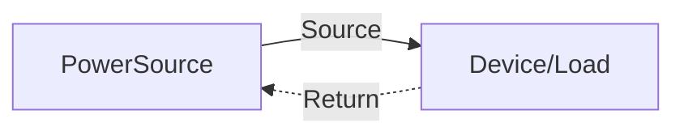
Placing a switch on one of the "legs" will allow the circuit to be opened or closed, turning off or on (respectively) whatever device is connected inline with that circuit.
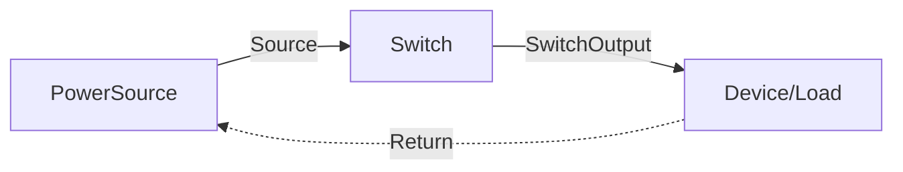
### Simple/Dumb Thermostats
These types of thermostats were able to do their switching mechanically and required no electrical power. An incoming `PowerSource` was mechanically switched to the different outgoing terminals/wires as needed.

All of the required `Return` paths (the wires going back to the source to complete the circuit) simply run from the individual devices themselves. This reduced the total number of wires needed at the thermostat by half; keeping costs down and the wiring simple. 

In the example below, only two wires are needed at the thermostat: 1) `IncomingSource` and 2) `OutgoingSource`.
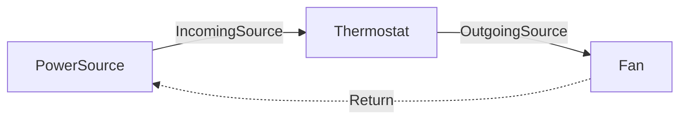
 Adding an additional device only requires one additional wire at the thermostat.
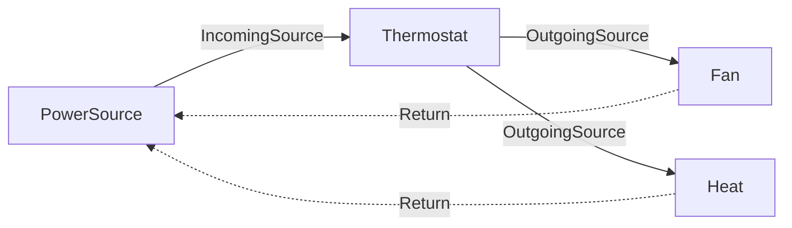
### Digital/Smart Thermostats
In contrast, Digital/Smart Thermostats do require their own source of power to operate (and to keep their backup batteries charged). The only way this can happen is for the thermostat to have its own `Return` back to the source. Effectively, making the thermostat one of the HVAC devices. 

The same `IncomingSource` that gets switched to all the other HVAC devices is now also (internally) used by the thermostat. The key here is seeing that each device has its own `Return`. This allows the thermostat to switch on/off other HVAC devices while maintaining its own continuous circuit.  
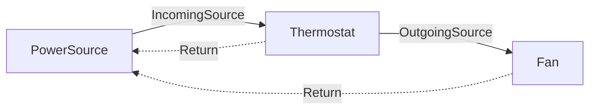
### The Infamous `C` Wire
In order for the thermostat to maintain a continous circuit, it must have its own `Return`. This is usually designated the `C` wire (sometimes also call the `common`wire). As should be apparent by now, without it, the thermostat doesn't have a `Return` path back to the source.  No `Return` means no complete circuit. No complete circuit means no power. No power means the thermostat can't operate or charge its backup battery.
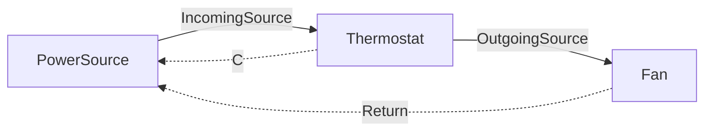
This is where things get troublesome. In old installations (or cheap builds), the thermostat wire bundle that was originally run through the walls to the thermostat might only have just enough wires to operate the installed HVAC devices - meaning, no available wire to act as the `C` wire.

If you find yourself in this spot, be sure to double check the wire bundle at the thermostat. Sometimes contractors will use a wire bundle with plenty of wires. To hide the excess unused wires, they'll just wrap them around the bundle and push them back into the opening in the wall or physically cut them at the opening of the wall. You might just be lucky enough to have the needed wire... you just can't see it.

If you're lucky enough to find that there are available unused wires in the bundle, you'll be able to use one as the `C` wire. You will need to make sure the other end of that new wire gets connected to the `C` terminal at the HVAC control board. Most contractors won't connect wires unless they're actually needed at the thermostat at the time of the initial install, so it's most likely not connected to the control board.

If you are one of the unlucky ones, you'll need to use some sort of external power or adapter. The Google Nest Power Connector or one of the many different "Add-A-Wire" devices that exist are all the rage today, however, you'll need to do your own research on those specific devices to see what will work with your specific configuration.

### Sources (`R`, `Rh`, `Rc`, jumpers)
Okay, so the last thing I'll cover in this overdone write up is why you might have multiple `R` wires or jumpers on the different `R` terminals at your thermostat.
#### `Rh` & `Rc`
Some heating and cooling systems are separate units/systems. In these cases, they can have their own individual `PowerSources`. `Rh` usually for a Heating System and `Rc` for a Cooling System.

Example: To power the cooling system, the thermostat would simply connect `Rc` to the `Y`. To power the heating system, the thermostat would connect the `Rh` to the `W`.
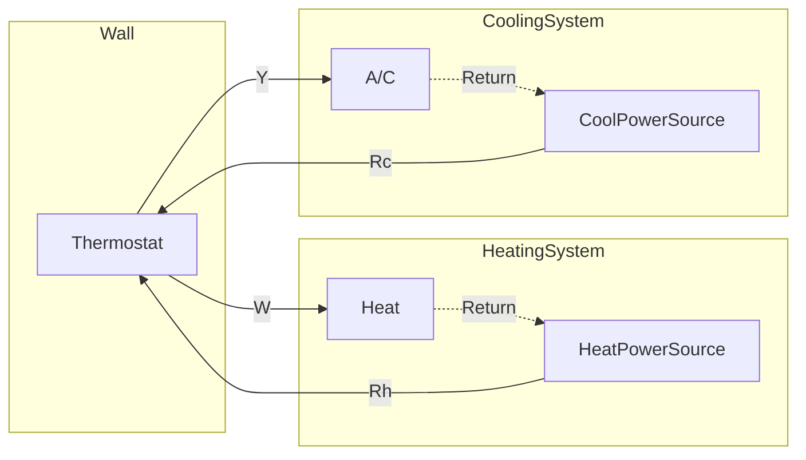
By now, you might be able to see where this could lead to problems dealing with `Returns`. Each `Return` needs to go back to its respective `PowerSource`. We don't want any "cross-mojonation" happening here. 

Example: the A/C's `Return` wire goes back to the `CoolPowerSource`, so supplying the A/C from the `HeatPowerSource` isn't what we want happening here.
#### "Jumpers"
Simple/Dumb Thermostats didn't have "brains" to understand how a complete home system might work, so they were made to handle split Heating and A/C systems to cover all the "bases". Having split `Rc` and `Rh` terminals does just that. Modern HVAC systems have moved to combining both heating and cooling into single systems, meaning there's only one `PowerSource` and it's shared between the Heat and A/C. 

If you upgraded to one of these combined systems and wanted to keep your old thermostat (or preferred to keep to a cheaper thermostat), then a "jumper" wire was needed to connect the `Rh` and `Rc` terminals of the thermostat together. This allows for a single `PowerSource` to be connected to both at the same time... kind of like a crude splitter. 
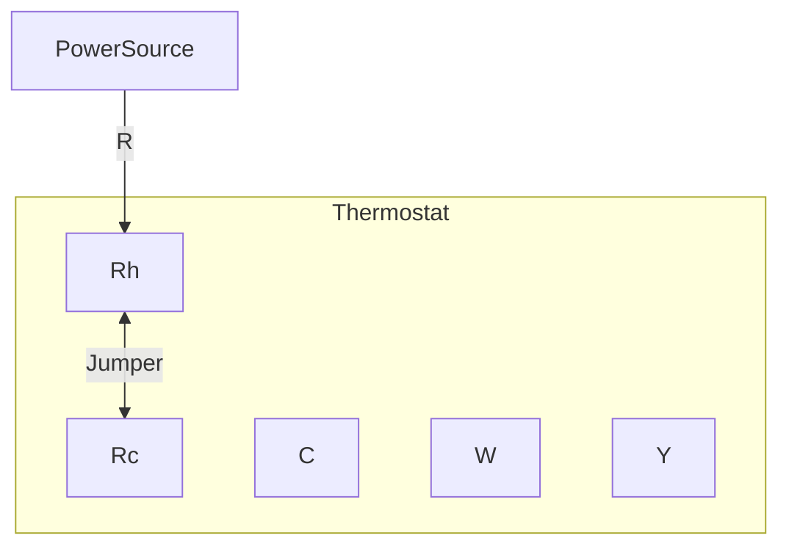
Most modern Digital/Smart Thermostats can do this internally and no longer require any "jumper" wire to be used. (See your thermostats documentation on how to go about doing this... usually through the initial setup or going through the thermostat's settings menus.)
# More Simple Examples
So... that's about it. Pretty simple device with some simple wiring. Anyway, below are just some simple examples that progressively expand in complexity. The key take-away from here to to observe how each device is part of its own circuit (Source, Thermostat, Device, and Return).
 
## Simple/Dumb Thermostat - Fan:
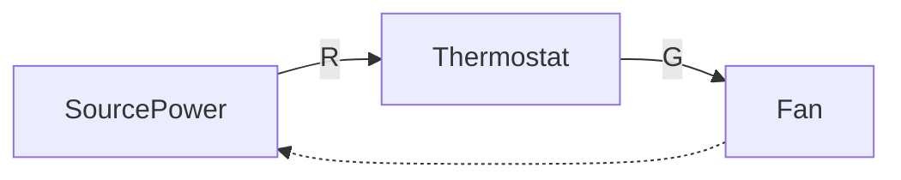
## Simple/Dumb Thermostat - Heat + Fan:
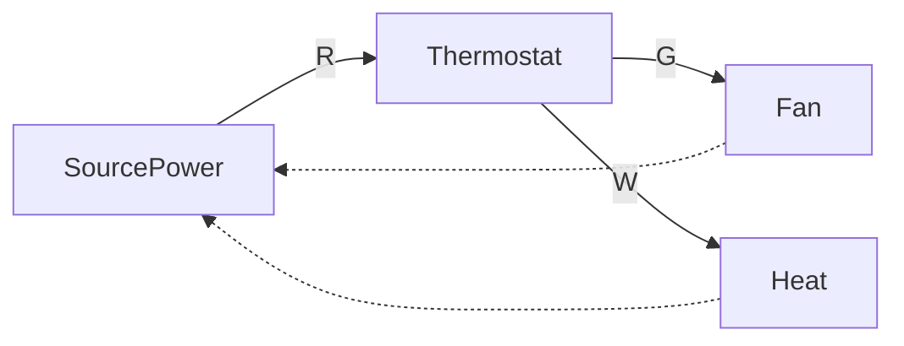
## Simple/Dumb Thermostat - A/C + Fan:
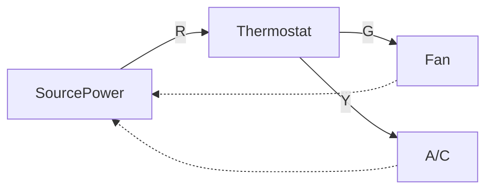
## Simple/Dumb Thermostat - Heat & A/C + Fan:
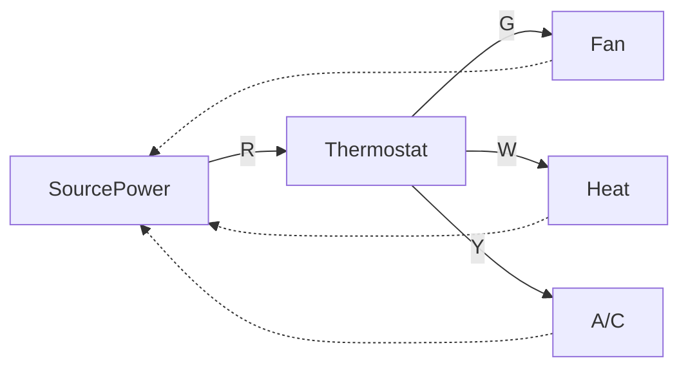
## Digital/Smart Thermostat - Operation/Charging:
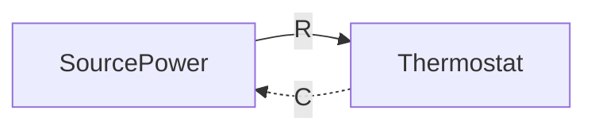
## Digital/Smart Thermostat - Operation/Charging + Heat & A/C + Fan:
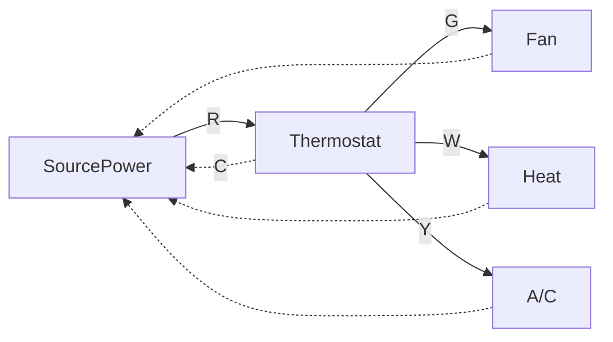
## Digital/Smart Thermostat - Operation/Charging (powered from HeatPowerSource) + Split Heat & A/C + Fan (powered from CoolPowerSource):

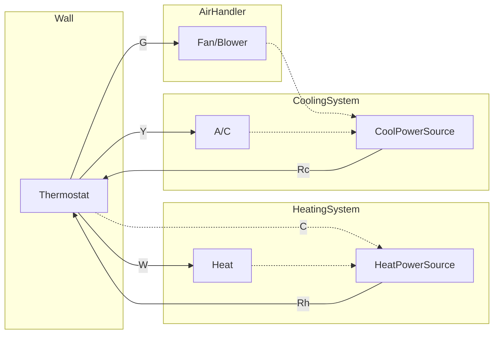
